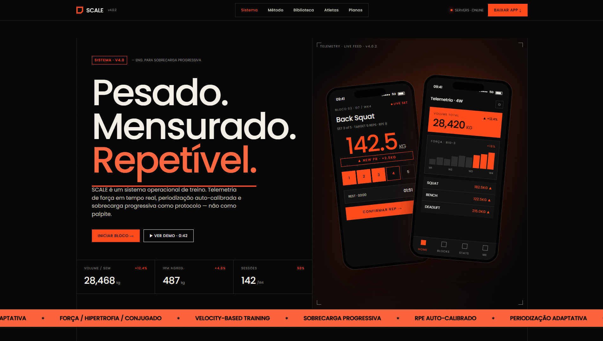
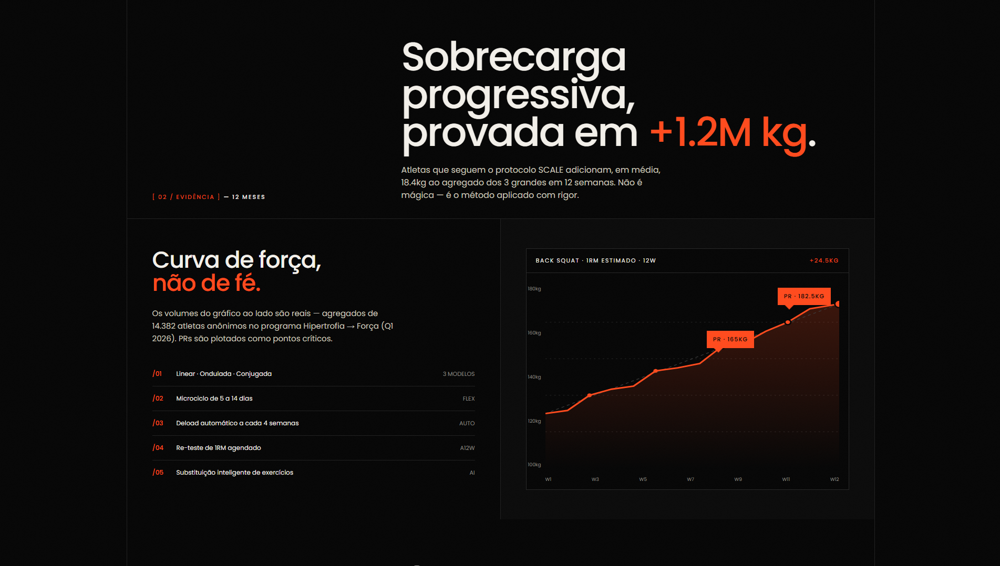
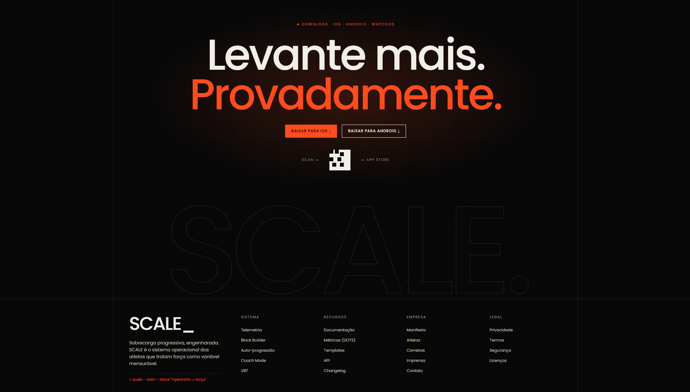

<div align="center">
  

  # SCALE: Trust your Instinct, Defy your Limits

  [](https://reactjs.org/)
  [](https://vitejs.dev/)
  [](https://tailwindcss.com/)
  [](https://gsap.com/)
  [](https://opensource.org/licenses/MIT)
</div>

---

## About

**SCALE** is a workout and nutrition tracking app for athletes and fitness enthusiasts focused on structured progressive overload. This repository is the cinematic landing page built to promote it.

The landing page was developed as part of my undergraduate thesis (TCC) in Software Engineering, with emphasis on advanced frontend engineering: scroll-driven animations, a custom design system, and high-fidelity UI mockups that mirror the app's interface.

> 🏗️ The SCALE app (backend + mobile) is currently in development.

---

## Screenshots

<!-- Add screenshots of the landing page here -->




---

## Key Features

- **Brutalist Design System** — Dense dark theme with flame orange (`#F97316`) accent palette, uppercase typography, and navigation with translucent borders
- **GSAP Animations** — Scroll-triggered animations via `ScrollTrigger`, staggered entry effects, and magnetic interactions on interactive elements
- **Sticky Stacking UI** — Components that visually mimic the final app interface with depth through sticky scroll layering
- **SVG Noise & Texture** — Native SVG noise and linear grid gradients replicating industrial tracking panels
- **Optimized Performance** — Vite build delivers sub-second rendering with Hot Module Replacement in development

---

## Tech Stack

| Tool | Version | Role |
|------|---------|------|
| [React](https://react.dev/) | 19.0.0 | Component-based UI |
| [Vite](https://vitejs.dev/) | 6.2.0 | Build tool & dev server |
| [Tailwind CSS](https://tailwindcss.com/) | 4.0 | Utility-first styling |
| [GSAP + ScrollTrigger](https://gsap.com/) | 3.12 | Scroll-driven animations |
| [Lucide React](https://lucide.dev/) | — | Icon library |

---

## Installation

```bash
git clone https://github.com/BeiruthDEV/SCALE.git
cd SCALE
npm install
npm run dev       # http://localhost:5173
```

To build for production:

```bash
npm run build     # output → /dist
```

---

## Project Structure

```text
SCALE/
├── public/                 # Static assets and meta files
├── src/
│   ├── components/
│   │   ├── Hero.jsx        # Main cinematic cover section
│   │   ├── Header.jsx      # Navigation with blur + magnetic effects
│   │   ├── Features.jsx    # App features with micro-UI interactions
│   │   ├── Protocol.jsx    # GSAP Sticky Stacking UI screens
│   │   ├── Philosophy.jsx  # Parallax manifesto section
│   │   └── Footer.jsx      # CTA footer
│   ├── App.jsx
│   ├── index.css           # Global Tailwind styles + custom keyframes
│   └── main.jsx
├── tailwind.config.js      # Design tokens and palette
└── vite.config.js
```

---

## License

MIT — free to use for study and portfolio purposes.

---

<div align="center">

**[BeiruthDEV](https://github.com/BeiruthDEV)** · [LinkedIn](https://www.linkedin.com/in/matheusbeiruth)

</div>